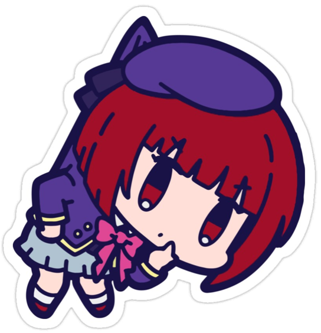
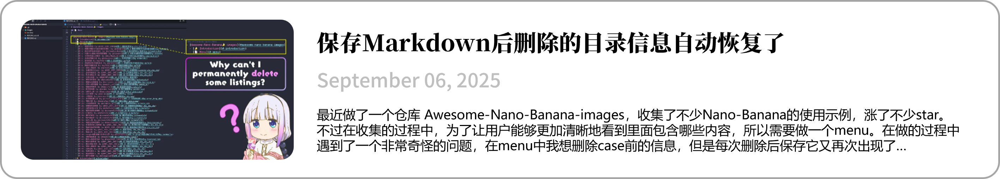

<!-- # 👋 Hi there, I'm Serein (Zilong Huang)  -->

  
   
  
    
    
    
    
    
    
    

---

  

    <h3> About me</h3>
    

      <li> 🎓 A Grade 2020 GST Student in SYSU. Currently a graduate student at SYSU.
      <li> ⚡ Interested in 3D reconstruction / generation, game development, front-end development.
      <li> 🎮 I am a hardcore anime fan, and I also enjoy playing all kinds of games.
      <li> 🎶 I listen to a wide range of music genres, and my favorites are R&B and citypop. I’m also a fan of KPOP.
      <li> 🔭 I am learning everything I find interesting.
    

    

      
      
      
      
      
      
      
      
    

  

  

    
    
  

  

---

  <h3 style="position: relative; margin-bottom: 10px;">
    About Working
  </h3>
  

    

      <h3>🔧 Tools</h3>
       
      
    

    

      <h3>🛠️ Tech Stack</h3>
      <a href="https://skillicons.dev">
         
        
      </a>
    

    

      <h3>🌟 Interesting / Learning</h3>
      <a href="https://skillicons.dev">
         
        
      </a>
    

  

 
 📠<b>Recent Blogs</b>: 

 
    
   
    
   
    
   

